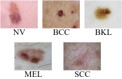
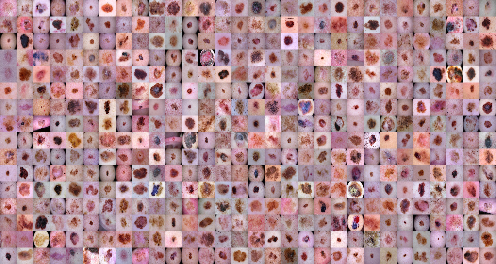
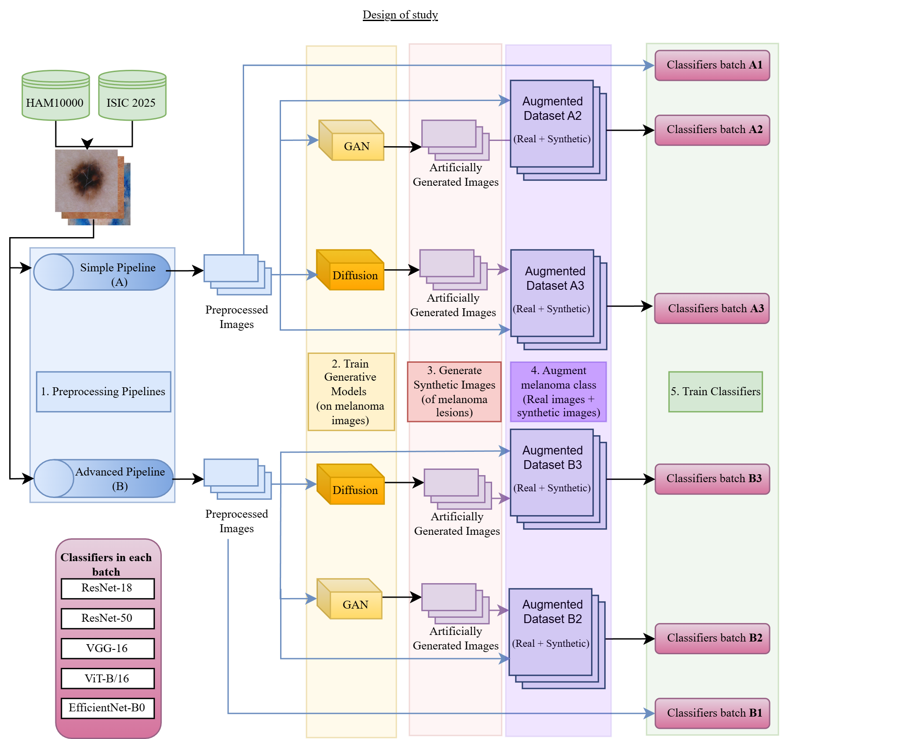
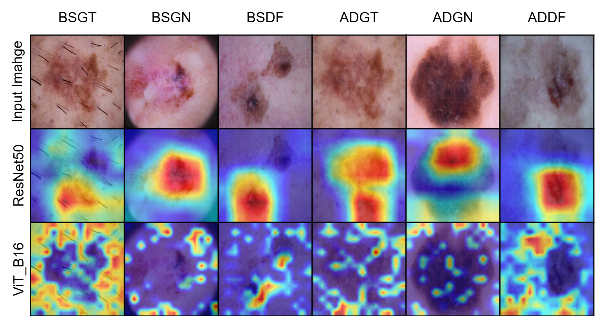

# SkinGenBench: Generative Model and Preprocessing Effects for Synthetic Dermoscopic Augmentation in Melanoma Diagnosis

[](https://opensource.org/licenses/MIT)
[](#add-link-here)
[](https://www.python.org/)
[](https://pytorch.org/)


<p align="center">
  
</p>

> 📢 Official PyTorch implementation of **SkinGenBench: Generative Model and Preprocessing Effects for Synthetic Dermoscopic Augmentation in Melanoma Diagnosis**  
> N. A. Adarsh Pritam, Jeba Shiney O, Sanyam Jain  
[[Project]](https://github.com/adarsh-crafts/SkinGenBench) | [[Code]](https://github.com/adarsh-crafts/SkinGenBench)
---

## 🌟 Highlights
- **First Systematic Benchmark:** Controlled evaluation of preprocessing complexity (basic geometric vs. advanced artifact removal) across GANs (StyleGAN2-ADA) and Diffusion Models (DDPM) for dermoscopic melanoma synthesis.
- **Architecture > Preprocessing:** Demonstrates that generative model choice has stronger impact than preprocessing complexity on both image fidelity and diagnostic utility.
- **StyleGAN2-ADA Superiority:** Achieves lowest FID (≈65.5) and KID (≈0.05) with better class anchoring, while diffusion models produce higher variance at the cost of perceptual fidelity.
- **Significant Clinical Impact:** Synthetic augmentation delivers 8-15% absolute melanoma F1-score improvements, with ViT-B/16 reaching F1≈0.88 and ROC-AUC≈0.98 (≈14% improvement over baselines).
- **Reproducible Framework:** Unified assessment combining generative metrics (FID, IS, KID), downstream performance across five architectures (CNNs and transformers), and interpretability analysis via Grad-CAM on 14,116 dermoscopic images.


## 📊 Dataset

<p align="center">
  
</p>

Overall experimental design showing dual preprocessing pipelines, generative model training, synthetic data augmentation, and downstream classifier evaluation for melanoma diagnosis.

**Table**: Overview of curated dermatology dataset used in our study. The dataset combines ISIC 2025 (MLK10k) and HAM10000 sources.

| Class | Abbr. | Images | Percentage |
|---|---|---|---|
| Nevus | NV | 7,424 | 52.60% |
| Basal Cell Carcinoma | BCC | 3,026 | 21.43% |
| Benign Keratosis-like | BKL | 1,637 | 11.60% |
| **Melanoma** | **MEL** | **1,563** | **11.03%** |
| Squamous Cell Carcinoma | SCC | 466 | 3.34% |
| **Total** | | **14,116** | **100%** |

**Dataset Sources:**
- [ISIC 2025 (MLK10k)](https://api.isic-archive.com/doi/milk10k/)
- [HAM10000](https://dataverse.harvard.edu/dataset.xhtml?persistentId=doi:10.7910/DVN/DBW86T)

---

## 🧠 Overview

<p align="center">
  
  <br>
  <em>Figure: General framework of SkinGenBench showing the two preprocessing pipelines (Basic and Advanced), generative model training (StyleGAN2-ADA and DDPM), and evaluation through image quality metrics and downstream classification tasks.</em>
</p>

**Preprocessing Pipelines:**
- **Pipeline A (Basic):** Standard augmentations including random rotations, horizontal/vertical flips, and resizing to 256×256 resolution.
- **Pipeline B (Advanced):** All transformations from Pipeline A plus DullRazor artifact removal algorithm to eliminate hair and ruler marks through morphological black-hat transformation and texture reconstruction.

**Generative Models:**
- **StyleGAN2-ADA:** Adaptive discriminator augmentation, 8-layer mapping network, progressive synthesis from 4×4×256 to 256×256. Trained for 240,000 images with transfer learning from FFHQ dataset.
- **DDPM:** U-Net architecture with self-attention and residual blocks, 500-step diffusion process. Trained for 120 epochs with transfer learning from CELEBA-HQ dataset.

**Image Subset Nomenclature:**

| Source | Basic Preprocessing (BS) | Advanced Preprocessing (AD) |
|--------|--------------------------|------------------------------|
| Ground Truth | BS_GT | AD_GT |
| StyleGAN2-ADA | BS_GN | AD_GN |
| DDPM | BS_DF | AD_DF |

---

## 📄 Publication
**SkinGenBench: Generative Model and Preprocessing Effects for Synthetic Dermoscopic Augmentation in Melanoma Diagnosis**  
N. A. Adarsh Pritam, Jeba Shiney O, Sanyam Jain  
*Alliance University, Bangalore & Østfold University College, Norway*  
[[GitHub]](https://github.com/adarsh-crafts/SkinGenBench) | [[PDF]](#add-link-here)

---

## 📑 Table of Contents
- [Installation](#installation)
- [Model Zoo](#model-zoo)
- [Training](#training)
- [Results](#results)
- [Citation](#citation)

---

## Installation

1. **Clone the repository:**
```bash
   git clone https://github.com/adarsh-crafts/SkinGenBench.git
   cd SkinGenBench
```

2. **Create a virtual environment:**
```bash
   python3 -m venv venv
   source venv/bin/activate
   pip install -r requirements.txt
```

3. **Install PyTorch:**
   Install PyTorch following instructions from [PyTorch official site](https://pytorch.org/).

**requirements.txt**
```
torch>=2.0.0
torchvision>=0.15.0
numpy
opencv-python
matplotlib
scikit-learn
scipy
tqdm
h5py
pandas
Pillow
```

---

## Model Zoo
Pretrained Models for StyleGAN2-ADA and DDPM which were finetuned are available here in table below: 

### StyleGAN2-ADA Models
| Model              | Configuration      | File          |
|--------------------|--------------------|------------------|
| StyleGAN2-ADA      | FFHQ 256×256 pretrained | [NVIDIA CDN](https://nvlabs-fi-cdn.nvidia.com/stylegan2-ada-pytorch/pretrained/transfer-learning-source-nets/ffhq-res256-mirror-paper256-noaug.pkl)    |
| DDPM               | CELEBA-HQ 256×256 pretrained | [Hugging Face](https://huggingface.co/google/ncsnpp-ffhq-256) |
---

## Training

Train StyleGAN2-ADA, DDPM and the classifiers with the provided configurations in each nested directory.


**Training Details:**

| Configuration      | Minimum            | Maximum          |
|--------------------|-------------------|------------------|
| GPU               | NVIDIA RTX 4060 8GB × 1 | NVIDIA L4 22GB × 1    |
| RAM               | 8 GB            | 22 GB           |
| Input Resolution  | 256×256×3         | 256×256×3        |

---

## Results

<p align="center">
  
  <br>
  <em>Figure: t-SNE embeddings showing ground truth (GT), StyleGAN2-ADA (GN), and DDPM (DF) distributions for basic (left) and advanced (right) preprocessing pipelines.</em>
</p>


**Fréchet Inception Distance (FID)** - Lower is better

| Model | Basic Pipeline (BS) | Advanced Pipeline (AD) |
|-------|---------------------|------------------------|
| StyleGAN2-ADA (BSGN/ADGN) | 79.36 | **65.47** |
| DDPM (BSDF/ADDF) | 83.04 | 90.22 |

**Kernel Inception Distance (KID)** - Lower is better

| Model | Basic Pipeline (BS) | Advanced Pipeline (AD) |
|-------|---------------------|------------------------|
| StyleGAN2-ADA (BSGN/ADGN) | 0.0664 | **0.0546** |
| DDPM (BSDF/ADDF) | 0.0684 | 0.0772 |

**Inception Score (IS)** - Higher is better

| Model | Basic Pipeline (BS) | Advanced Pipeline (AD) |
|-------|---------------------|------------------------|
| StyleGAN2-ADA (BSGN/ADGN) | **3.22** | 2.77 |
| DDPM (BSDF/ADDF) | 2.50 | 2.45 |

**Global Classification Performance - Best Results (Pipeline A2: Basic + StyleGAN2-ADA)**

| Model | Macro-F1 | Accuracy | ROC-AUC | Brier Score |
|-------|----------|----------|---------|-------------|
| **ViT-B/16** | 0.8393 | 0.8985 | **0.9822** | **0.0302** |
| **ResNet-50** | **0.8393** | **0.8989** | 0.9802 | 0.0314 |
| VGG-16 | 0.8181 | 0.8797 | 0.9774 | 0.0365 |
| EfficientNet-B0 | 0.7977 | 0.8657 | 0.9698 | 0.0402 |
| ResNet-18 | 0.7525 | 0.8360 | 0.9611 | 0.0479 |

**Melanoma (MEL) Classification - Best Results (Pipeline A2: Basic + StyleGAN2-ADA)**

| Model | MEL F1 | Sensitivity | Specificity | Precision | ROC-AUC | PR-AUC |
|-------|--------|-------------|-------------|-----------|---------|--------|
| **ViT-B/16** | **0.8831** | **0.8564** | **0.9798** | **0.9115** | **0.9802** | **0.9511** |
| ResNet-50 | 0.8663 | 0.8401 | 0.9758 | 0.8941 | 0.9787 | 0.9445 |
| VGG-16 | 0.8438 | 0.8108 | 0.9730 | 0.8796 | 0.9729 | 0.9228 |
| EfficientNet-B0 | 0.8126 | 0.7781 | 0.9667 | 0.8503 | 0.9633 | 0.9043 |
| ResNet-18 | 0.7724 | 0.7390 | 0.9576 | 0.8089 | 0.9542 | 0.8774 |

**Key Findings:**
- Synthetic augmentation improved melanoma F1-score by **8-15%** absolute across all architectures
- ViT-B/16 achieved the best melanoma-specific performance (F1≈0.88, ROC-AUC≈0.98)
- Pipeline A (Basic preprocessing) consistently outperformed Pipeline B (Advanced preprocessing)
- StyleGAN2-ADA generated more realistic and class-coherent samples than DDPM (lower FID, higher IS)

<p align="center">
  
  <br>
  <em>Figure: Grad-CAM saliency maps from ViT-B/16 and ResNet-50 classifiers trained on A2 pipeline (Basic + StyleGAN2-ADA). ResNet-50 produces compact, morphologically aligned activations, while ViT-B/16 shows broader, context-sensitive patterns. Diffusion-augmented samples yield smoother anatomically coherent attention maps.</em>
</p>

---

## Citation

If you find this work useful, please cite our paper:
```bibtex
@inproceedings{pritam2025skingenbench,
  title={SkinGenBench: Generative Model and Preprocessing Effects for Synthetic Dermoscopic Augmentation in Melanoma Diagnosis},
  author={Pritam, N. A. Adarsh and O, Jeba Shiney and Jain, Sanyam},
  booktitle={Proceedings of the International Conference on Medical Image Computing and Computer-Assisted Intervention},
  year={2025},
  organization={Springer}
}
```
---